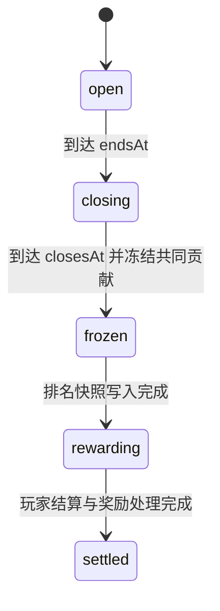
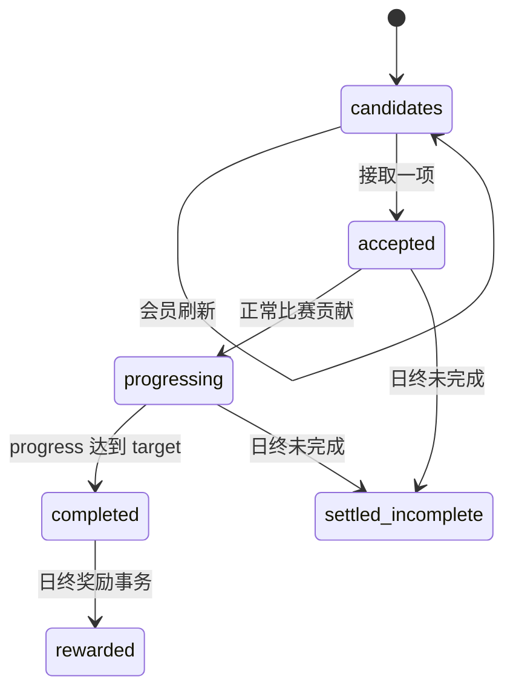
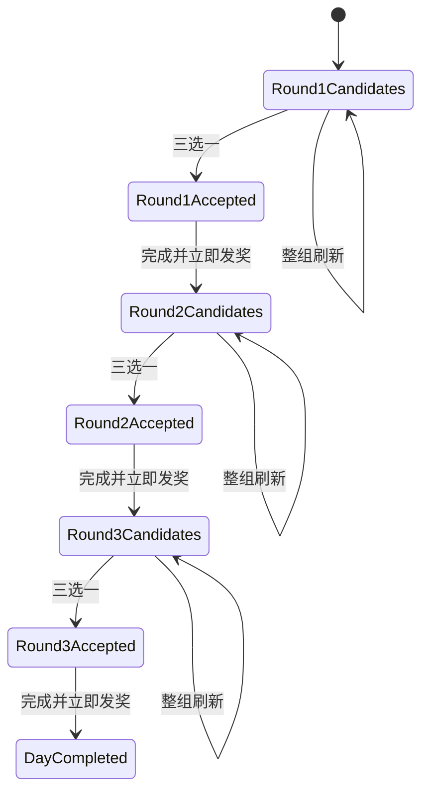

# 每日挑战数据模型与状态机

## 1. 数据设计原则

- 挑战日冻结配置版本，历史日不跟随发布指针变化。
- 候选任务、已接任务和共同任务保存 assignment 快照。
- 玩家操作、比赛贡献和奖励分别建立幂等流水。
- 赛季积分增加与奖励流水创建处于同一事务。
- 排名冻结后保存结果，不在奖励阶段重新读取浮动贡献。
- 客户端暂存进度不写 Firestore，正式进度只来自正常 `/game/end`。

## 2. Firestore 集合

| 集合 | 主键与用途 |
|---|---|
| `daily_challenge_config` | `draft` 和 `published` 指针 |
| `daily_challenge_config_versions` | `v{version}`，不可变发布快照 |
| `daily_challenge_config_audits` | 保存、发布、回滚的操作者和时间审计 |
| `daily_challenge_days` | `dayId`，挑战日、冻结配置、共同任务和状态 |
| `player_daily_challenges` | `dayId_steamId`，玩家当日候选、接取、进度、刷新和连续状态 |
| `daily_challenge_global_contributions` | `dayId_steamId`，玩家当日共同贡献累计 |
| `daily_challenge_global_rankings` | 冻结后的玩家贡献、档位和奖励 |
| `daily_challenge_match_ledger` | `matchId_steamId`，单局贡献幂等流水 |
| `daily_challenge_operation_ledger` | 玩家操作 `requestId` 幂等结果 |
| `daily_challenge_reward_ledger` | 固定奖励 ID、积分、来源、快照和通知状态 |

## 3. 配置模型

### 3.1 配置指针

`daily_challenge_config/draft` 保存可编辑草稿；`daily_challenge_config/published` 保存当前发布版本 ID。指针包括 `updatedBy` 和 `updatedAt`。

### 3.2 发布版本

`daily_challenge_config_versions/v{version}` 保存：

- 版本号与状态；
- 完整配置快照；
- 创建者、创建时间和发布时间。

相同版本号只能对应相同内容。回滚改变发布指针和版本状态，不修改历史挑战日中冻结的 `configVersionId`。

## 4. 挑战日模型

`daily_challenge_days/{dayId}` 保存：

- `schemaVersion`；
- `dayId`、`startsAt`、`endsAt`、`closesAt`；
- `configVersionId`、`configVersion`；
- `globalTask` 和 `globalRewardTiers` 快照；
- `status`；
- 冻结、奖励和完成时间；
- 共同总进度、是否达标和有效贡献人数。

挑战日一旦创建，当天所有玩家共享同一配置版本和同一共同任务。

## 5. 玩家日状态

`player_daily_challenges/{dayId}_{steamId}` 主要字段分组：

### 5.1 身份与版本

- `steamId`、`dayId`；
- `schemaVersion`；
- `configVersionId`、`configVersion`；
- `startsAt`、`endsAt`。

### 5.2 任务

- `globalTask`、`globalRewardTiers`；
- `candidates`；
- `seenTaskIds`；
- `acceptedTask`、`acceptedAt`；
- `progress`、`completedAt`。

### 5.3 刷新

- `refreshCostsMemberPoint`；
- `refreshIndex`；
- `freeRefreshUsed`；
- `paidRefreshesUsed`。

### 5.4 连续与奖励

- `streakDays`、`streakCycleId`；
- 当天触发的 `streakRewardDays`、`streakRewardSeasonPoint`；
- `streakMilestones` 快照；
- `unreadRewardCount`；
- `settlementProcessedAt`。

## 6. assignment 快照

任务实例包含：

- 配置身份：`taskId`、`revision`；
- 日内身份：`assignmentId`；
- 任务范围、指标、单位和可选 `heroName`；
- 三语标题与描述；
- 目标、当前进度和赛季积分奖励；
- `minDataVersion`。

assignment 快照是历史记录、进度匹配和奖励展示的共同依据。客户端应提交 `assignmentId`，不能只提交容易重复的 `taskId`。

## 7. 挑战日状态机



状态职责：

| 状态 | 允许行为 |
|---|---|
| `open` | 创建玩家日状态、接取、刷新、接收属于当日的比赛贡献 |
| `closing` | 拒绝新接取和刷新；宽限接收在 `endsAt` 前开始的比赛回传 |
| `frozen` | 共同贡献与排名已经固定 |
| `rewarding` | 幂等处理个人、共同和连续奖励 |
| `settled` | 当日全部处理完成，只读保留 |

`closing` 宽限期为 120 分钟。比赛归属由 `matchStartedAt` 决定，不因结束时间跨日而改变。

## 8. 玩家任务状态



当天没有接取任务时，不生成个人进度，也不计入连续完成。共同贡献与个人任务状态相互独立。

## 9. 连续完成状态

日终按当天个人任务是否完成推进：

- 未完成：`streakDays = 0`；
- 完成且上一连续状态有效：天数加一；
- 完成但上一挑战日未连续：从第 1 天开始；
- 命中里程碑：生成固定连续奖励；
- 达到最高里程碑：发放奖励后把存储天数归零，下一次完成进入新循环。

连续状态只由个人任务完成决定，共同任务不参与。

## 10. 幂等模型

### 10.1 操作幂等

`accept`、`refresh`、`view` 以操作类型、SteamID、挑战日和 `requestId` 标识。重复请求读取已经保存的 `DailyChallengeActionResult`，不重复接取、扣费或修改通知状态。

### 10.2 比赛幂等

`daily_challenge_match_ledger` 以 `matchId + steamId` 标识单局玩家贡献，保存上报值和实际应用值。个人任务在本局完成时，ledger 同时保存冻结的 `personalReward` 快照和 `personalRewardLedgerId`。重复 `/game/end` 不重复增加个人进度、共同贡献或赛季积分，但可以依据该标记回显同一笔个人奖励。

### 10.3 快照顺序与异步防回退

玩家快照的 `dayId` 决定挑战日先后，`updatedAt` 决定同一挑战日内的提交顺序。VScript 私有缓存和 Panorama 页面状态使用同一替换规则：

1. 不同 `dayId` 时只接受更大的挑战日；
2. 同日当前快照有 `updatedAt`、传入快照缺失时拒绝传入快照；
3. 同日两边都有 `updatedAt` 时，只接受 `incoming.updatedAt >= current.updatedAt`；
4. 同日两边都没有时间戳时保持滚动部署兼容，允许替换；
5. 相同时间戳允许替换，用于只叠加本局临时进度、但没有新增后端持久化版本的 UI 快照。

被缓存拒绝的旧响应不能继续发送给 Panorama。接取响应只有在快照被接受、玩家身份仍有效且返回的 `acceptedTask.assignmentId` 与请求一致时，才允许写入本局接取基线。

### 10.4 奖励幂等

个人、共同和连续奖励使用固定 ID。奖励事务先检查奖励文档是否存在，再同时创建流水并增加玩家赛季积分，避免重试或服务重启导致重复发放。

## 11. 共同排名冻结

冻结步骤：

1. 把挑战日切换为冻结流程并记录时间。
2. 读取贡献值大于 `0` 的玩家。
3. 汇总共同进度并判断是否达到目标。
4. 达标时按贡献降序、SteamID 升序排序。
5. 最高档和中间档名义席位向上取整。
6. 档位边界并列进入较高档。
7. 保存 `daily_challenge_global_rankings`。
8. 奖励阶段只读取冻结排名。

共同目标未达成时，不生成共同奖励；有贡献但未达标的玩家不会获得共同任务积分。

## 12. 通知状态

奖励流水的通知状态为：

```text
pending -> notified -> viewed
```

- `pending`：积分已入账，尚未进入开局弹窗；
- `notified`：已被 `/game/start` 的 `pointInfo` 领取展示；
- `viewed`：玩家打开每日挑战奖励记录后确认已查看。

通知状态不参与积分事务的再次发放判断；奖励 ID 才是发放幂等依据。

## 13. 玩家三轮状态机（快照 v2）

玩家日状态新增：`totalRounds`、`currentRound`、`completedRoundCount`、`completedTasks`。个人任务 assignment 冻结 `configVersion`、`star`、`round`、`totalRounds`、`target` 和 `rewardSeasonPoint`。



只有进入 `DayCompleted` 才写 `completedAt`，并在日结时视为连续完成一天。中间轮完成后 `progress=0`、`acceptedTask/acceptedAt` 清空，但整日共享的 `freeRefreshUsed`、`paidRefreshesUsed`、`refreshIndex` 和 `seenTaskIds` 不重置。

比赛 ledger ID 为 `matchId_steamId`。完成任务的 ledger 同时冻结本次 `personalReward.taskSnapshot` 和 `personalRewardLedgerId`，因此即使事务已清空当前接取任务，奖励服务仍使用刚完成的快照；同一比赛重试复用 ledger，不会再次推进或产生不同候选。

个人任务完成事务一次性读取挑战日、玩家状态、共同贡献、玩家积分账户和奖励 ledger，并一次性写入玩家挑战状态、共同贡献、玩家赛季积分、奖励 ledger 与比赛 ledger。任一步骤抛错都会使事务整体回滚。旧版本已经写入 `personalReward` 但没有 `personalRewardLedgerId` 的比赛 ledger 仅走幂等兼容补偿，不影响新写入路径。
