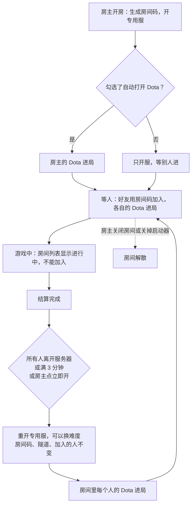
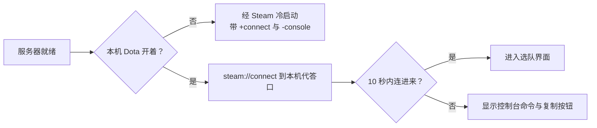

# 启动器联机 阶段 7：不重启 Dota 进局，房间跨局保留

> 状态：设计中，标 ★ 的待拍板。对应 #1418、#1420。长期说明见 [启动器联机](../../../launcher/README.md#联机)。

每局结束后，玩家都要退出 Dota 2 再进。原因是启动器只会通过 Steam 带上「连接本机服务器」的参数打开 Dota，而 Dota 已经开着时，Steam 不会把参数传进去。房间也是一局一个，打完就解散；下一局要重新开房、重新发码，好友也要重开 Dota。

## 实测

2026-10-11 在开发机上测试。Dota 由 Steam 正常启动，连的是用启动器同款参数开的专用服。

| 做法 | 结果 |
|---|---|
| Dota 开着时，再用 Steam 带参数启动（现在的做法） | Dota 不理 |
| 控制台输入 `connect` | 可以，玩家反馈 `20261008-fe8154f8` 已经在这样用 |
| `steam://connect/127.0.0.1:<端口>`，但没人回应 Steam 的服务器查询 | Steam 弹出「游戏信息」窗口，提示连接失败 |
| 同上，由启动器在该端口代答 Steam 的查询，其余数据包转给专用服，收到查询立即回复 | 同一时段 10 次里 6 次直接进入：Dota 加载地图，服务器记到玩家。其余 4 次 Steam 弹出「服务器指定的 app id 无效」 |
| 同上，收到查询后延迟 30 毫秒再回复 | 15 次全部直接进入 |
| Dota 已经在服务器里，或刚被关掉的服务器断开 | 照样断开旧的、连上新的，约 12 秒回到选队界面 |
| 连过二十多次本地专用服、没有重启的 Dota，从游廊开局 | 排队、接受、加载都正常，没有 VAC 提示，游戏显示「在线模式，玩家数据加载成功」 |

- 弹窗的原因是回复太快：Steam 处理 `steam://connect` 时先发一次查询，再尝试连接。查询还没有成功结果时，它会等下一个查询结果，那个结果不算成功就直接报错，报错文字写的是 app id，实际与 app id 无关。本机代答在 1 毫秒内就回复，有时早于 Steam 登记好这次查询，就被当成没收到。真实服务器隔着网络，不会碰到这种情况。换代答内容（带不带扩展字段、加不加查询验证码）都没用，延迟回复就好了。
- 专用服本身不回应 Steam 的查询，要开启得改玩家的 `gameinfo.gi`，所以由启动器代答。代答的只是 Steam 公开的查询格式，不读写 Dota 进程，也不改 Dota 文件。
- 地图文件只被专用服占用，Dota 客户端不占，所以下一局重开服务器前照常重建链接即可。

## 决定（建议）

- **进局一律经过 Steam**：Dota 没开时，照旧用 `-applaunch` 带 `+connect` 冷启动，另外让控制台可用（`+con_enable 1` 还是 `-console`，实现时实测哪个不会在 Dota 一打开就弹出控制台）；Dota 开着时，用 `steam://connect` 拉进来。都不直接运行 `dota2.exe`，所以不影响之后从游廊开局。
- **每台启动器在本机 27016 开一个代答口**：收到 Steam 的查询，延迟 30 毫秒回一份固定的服务器信息；其余数据包原样转给本机 27015，房主和单人转给专用服，加入者转进隧道。代答口收到 Dota 的连接包，就算「连进来了」。
- **自动进不去时，给控制台命令兜底**：10 秒内没连进来，就显示 `connect 127.0.0.1:27015` 和复制按钮，并说明在 Dota 设置里启用控制台、按 `\` 打开。所有人的命令都一样，而且永远不变。启动器不去关 Steam 的窗口。
- **「Dota 2 正在运行」的弹窗不再要求关闭 Dota**：默认直接拉进来。只有地图在两局之间更新过，才需要重开 Dota。
- **房间跨局保留，公开房间也一样**：房间从开到关是一个整体，每局用一个新的专用服。结算完成、所有人离开服务器后，启动器自动重开服务器；房间码、隧道、已加入的人都不变，所有人自动被拉进下一局。
- ★ **下一局什么时候开**：建议自动开，条件是结算完成，并且所有人都已离开服务器或结算完成已满 3 分钟（防止有人挂在结算界面）；另给房主一个「立即开下一局」按钮。房主不在电脑前时，只能靠自动开。
- ★ **换难度**：房主在启动器里随时可以换，对下一局生效；还没进入选英雄阶段时换，就立刻重开服务器。
- **加入者留在房间，直到自己点「退出房间」或关掉启动器**：关掉 Dota 不再等于退出房间。下一局就绪时，Dota 开着就自动拉进去；Dota 关着就在启动器上显示「进入游戏」，不替玩家冷启动 Dota。
- ★ **房主的「自动打开 Dota 2」勾选框**：默认勾上。取消勾选就只开服务器、不打开自己的 Dota，由第一个进入服务器的玩家当游戏内房主。#1418 的「只开服模式」用它代替，不另做一种模式。
- **房间码在房间存在期间不变**：好友留在房间里，就不用重新发码。跨天固定不做。

## 流程

「进局」在每台启动器上是这样做的：

加入者那边，「Dota 关着」时不冷启动，改为显示「进入游戏」按钮。

## 「游戏已开始」显示太早（#1420）

不是房间状态判断错了，而是启动器的 bug：房主关掉房间后 30 秒内重开，上一个房间的轮询线程醒来后，会用新房间的码报「已开始」。10-07 起进入过「已开始」的 1159 个房间里，有 298 个在开房 25 秒内就被标成已开始，其中 297 个的房主刚在 40 秒内关过上一个房间。修复见 #1486（已合并），和本阶段无关。

房间跨局以后，「已开始」改成按局记：房主每局上报局数，局数变了，API 就把开始、结束状态清零。

## 数据与统计

房间码不变，房间文档也不变。只要把「已开始」改成按局记，统计就不会乱：

| 数据 | 影响 |
|---|---|
| 加入、选线、连接质量（BigQuery） | 按「加入」记；加入者跨局留着，就算一次加入，不受影响 |
| 房间列表的「已进行 N 分钟」 | 每局重置开始时间后就正确 |
| 房间文档的开始、结束时间 | 只保留当前这局；另记局数，用来看一个房间打了几局 |
| 积分与战绩 | 按每局的结算请求记，和房间无关 |
| 踢人名单 | 按房间记，跨局保留 |

另外有两处时长要改：
- 中转通行证有效期从 6 小时延长到 24 小时，否则跨局玩久了，断线重连会失败。
- 房间的空闲暂停改成按每局的等待期计时。

## 要处理的问题

- **判断玩家在不在局内**：现在读的是 Dota 自己的日志，只有带参数冷启动的 Dota 才会写。改成房主、单人看专用服日志，加入者看隧道流量。
- **谁当游戏内房主**：先进服务器的人当房主。房主的启动器先拉自己的 Dota，一般最先进；偶尔被好友抢先是小问题，可以容忍。
- **Dota 里会留下「已断开连接」提示**：服务器重开时，Dota 会弹一个断开提示。实测不影响被拉进下一局，但提示要玩家自己点掉。

## 旧版兼容

- 新房主、旧加入者：旧加入者照旧一局一进，结束后关掉 Dota 就退出房间；下一局要用同一个房间码重新加入。
- 旧房主：不报局数，API 照旧一局一个房间。

## 分批

1. #1486：修「已开始」误标，已合并。
2. 不重启 Dota 进局：代答口、`steam://connect`、控制台命令兜底、在不在局内改看服务器日志。单人、开房、加入、「重新进入游戏」都用上；单人打完再点难度，也不用再关 Dota。
3. 房间跨局保留，加上「自动打开 Dota 2」勾选框：API 按局记状态，房主自动开下一局，加入者留在房间。动手前先出界面设计：房主面板的难度切换、「立即开下一局」、勾选框，加入者的「进入游戏」与「退出房间」。

2 和 3 一起随下一版启动器发布。3 的 API 改动要先部署，旧启动器不报局数，不受影响。

## 不做

- 跨天固定房间码：好友留在房间里就够了；跨天固定还要处理码外泄与回收。
- 游戏中加入、排队等下一局：先看房间跨局保留以后还有没有人要。
- 往 Dota 里发控制台命令（网络控制台端口）：这要操作 Dota 进程，违反设计底线。
