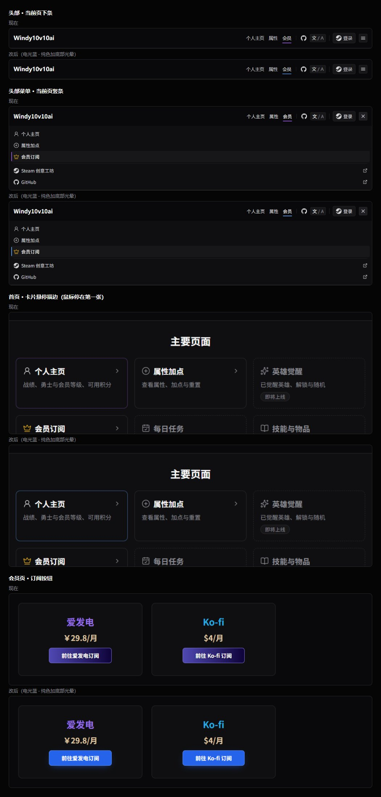
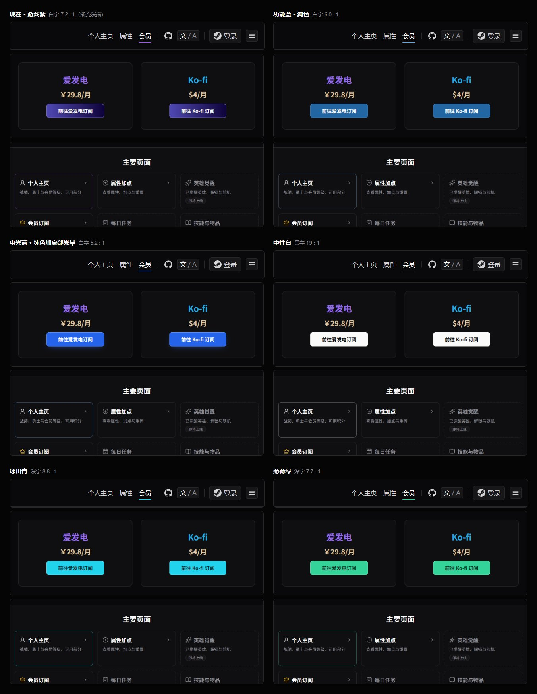
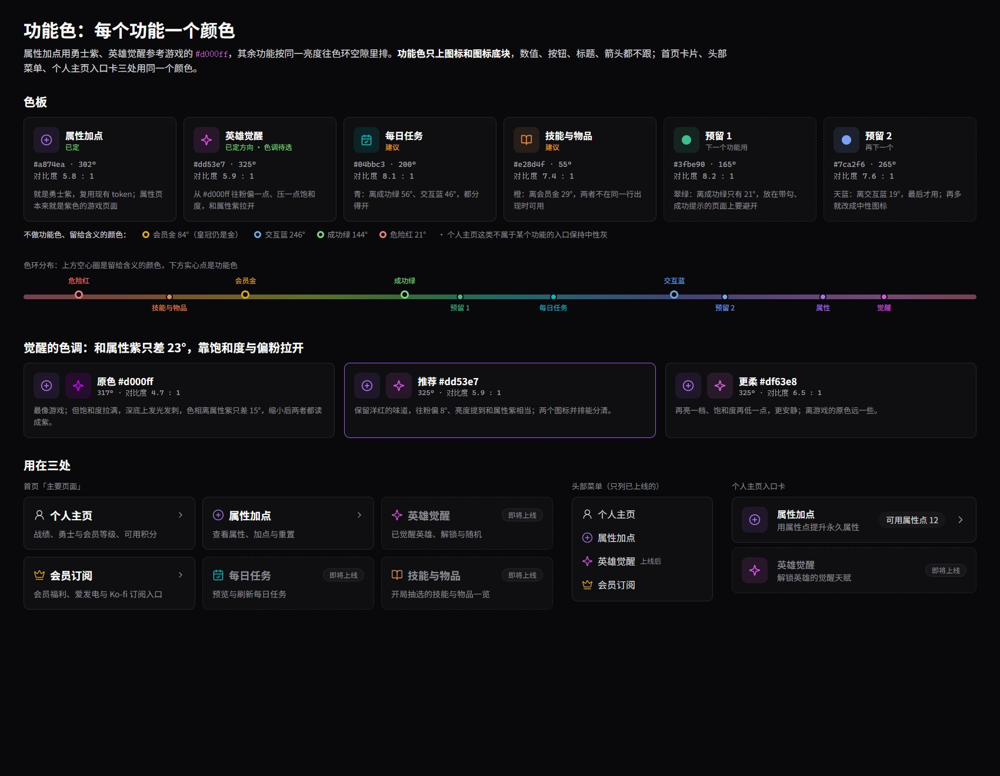
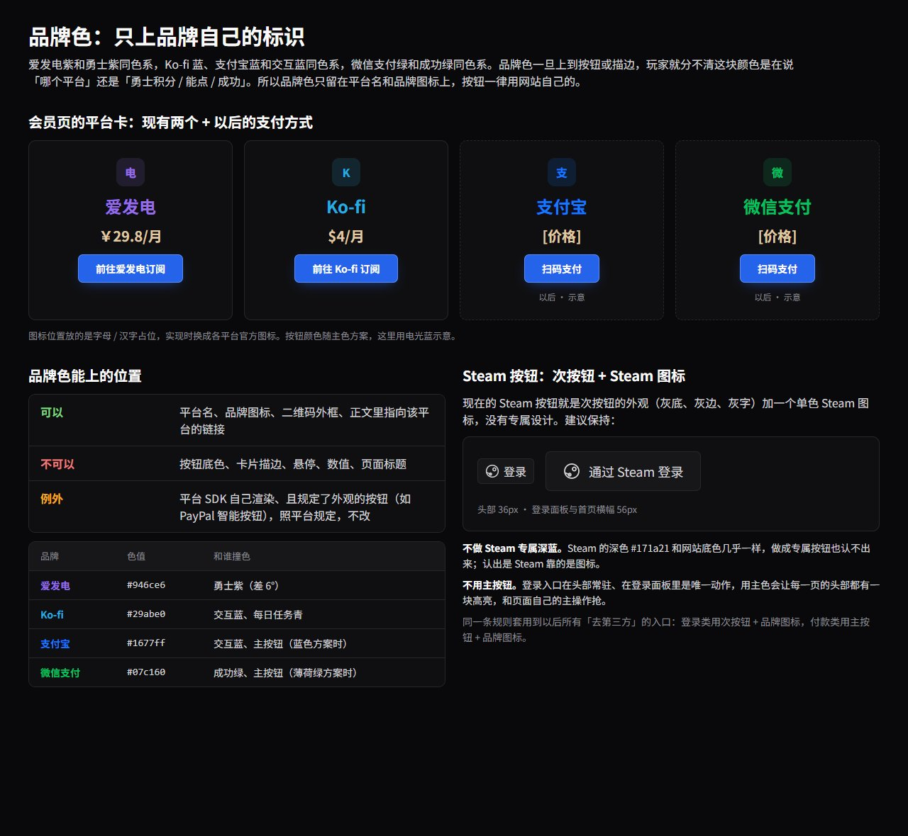

# 批次 12：配色体系

> 状态：已完成。网站主色采用电光蓝；功能色觉醒采用 `#dd53e7`，每日任务青、技能与物品橙采用。按钮、登录等待、头部退出见 [phase-12-controls.md](phase-12-controls.md)。

**一句话：每种颜色只管一件事。** 现在紫色既表示勇士积分，又是全站的交互色和默认按钮色，页面上到处是紫，玩家分不清哪块紫在说积分、哪块在说「能点」。

截图说明：「现在」截自线上 windy10v10ai.com（2026-09-14，`main`）；「改后」是在同一页面注入覆盖样式后截的，页面结构与文案不变。功能色、品牌色两张是设计稿渲染。

## 1. 分工

| 颜色 | 管什么 | 不许用在 |
|---|---|---|
| 中性灰 | 底色、卡片、分隔线、正文、次按钮 | — |
| 网站主色 | 主按钮、链接、当前页标记、可点击卡片的悬停描边、焦点框、转圈 | 数值、标题 |
| 勇士紫 | 勇士等级与积分、属性卡进度条、属性与觉醒页的操作按钮、勇士相关标题 | 交互反馈、通用按钮 |
| 会员金 | 会员等级与积分、皇冠、花会员积分的按钮、会员相关标题 | 交互反馈、通用按钮 |
| 功能色 | 各功能的图标与图标底块，见第 4 节 | 数值、按钮、标题、箭头 |
| 品牌色 | 第三方平台自己的标识，见第 5 节 | 按钮、描边、悬停、数值 |
| 状态色 | 成功、危险、警告 | 装饰 |

## 2. 紫色现在出现在哪

四处交互反馈和一处按钮是紫色，全部改成网站主色：

| 位置 | 现在 | 改成 |
|---|---|---|
| 头部横排当前页下条 | `--color-season-strong` | 主色的标记档 |
| 菜单当前页竖条 | `--color-season-strong` | 主色的标记档 |
| 可点击卡片悬停描边 `card-hover` | `--color-season-border` | 主色标记档 45–50% 透明度 |
| 键盘焦点框、转圈 | `--color-accent` | 主色的标记档 |
| 会员页订阅、激活结果、`Button` 默认 | `.btn-season` | 主按钮 |

保留紫色：个人主页的勇士等级、积分与进度条，属性页的进度条与加点按钮，勇士相关标题。批次 11 属性页等级框的悬停按货币色（勇士紫、会员金），不用 `card-hover`。

`--color-accent` 系列当初是为了让写了 `text-accent` 的组件不用改而指向勇士紫；交互色换掉后这层别名只会误导，实现时删除，调用点改用明确的 token。

## 3. 网站主色：五个方案

每张图同一位置：头部右半（看当前页下条）、会员页订阅按钮、首页卡片悬停（鼠标停在「个人主页」）。

| 方案 | 按钮 | 文字对比度 | 撞色 | 评价 |
|---|---|---|---|---|
| 功能蓝 | `#2266a4` 纯色、白字 | 6.0 : 1 | 无 | 稳，但暗、平 |
| **电光蓝（采用）** | `#2563eb` 纯色加底部光晕、白字 | 5.2 : 1 | 支付宝蓝、Ko-fi 蓝，品牌色只在标识上，不同处出现 | 亮、有网站自己的质感，和游戏渐变一眼分开 |
| 中性白 | `#fafafa`、黑字 | 19 : 1 | 无 | 深色页面里最抢眼；与游戏渐变按钮同页时割裂最明显 |
| 冰川青 | `#22d3ee`、深字 | 8.8 : 1 | 每日任务青、Ko-fi | 活泼，但每日任务要换色 |
| 薄荷绿 | `#34d399`、深字 | 7.7 : 1 | 成功绿、微信支付、预留 1 | 游戏感最强，但「绿 = 成功」已被占用 |

**采用电光蓝。** 蓝是撞色最少的色相：会撞的只有 Ko-fi 与支付宝，而品牌色只上品牌标识（第 5 节），不会和按钮、标记同处出现。青和绿各自要挤掉一个已有含义。

电光蓝的规格：

| 状态 | 底 | 边 | 光晕 |
|---|---|---|---|
| 默认 | `#2563eb` | `#5b8cf5` | `0 6px 18px -8px rgba(37,99,235,0.75)` |
| 悬停 | `#1d4ed8` | `#6b95f7` | 同默认 |
| 按下 | `#1e40af` | `#5b8cf5` | 无 |

白字在三种底上的对比度为 5.2 / 6.7 / 8.7 : 1。悬停往深走而不是往亮走，亮一档白字就掉到 AA 以下。

**光晕放在按钮下方，不上渐变。** 渐变是游戏按钮的识别特征，网站按钮保持纯色面，靠光晕与游戏按钮拉开、又不显得平。

交互标记档取 `#60a5fa`（对 `--color-panel` 7.5 : 1）。链接色 `--color-link` 同步从 `#6aa9e0` 调到这一档，页面上只剩一种蓝。

## 4. 功能色

**每个功能一个颜色。属性加点用勇士紫，英雄觉醒参考游戏的 `#d000ff`**，其余功能按相近亮度往色环空隙里排。

| 功能 | 色值 | 色相 | 对 `--color-panel` 对比度 | 状态 |
|---|---|---|---|---|
| 属性加点 | `#a874ea`（即 `--color-season`） | 302° | 5.8 : 1 | 已定 |
| 英雄觉醒 | `#dd53e7` | 325° | 5.9 : 1 | 已定 |
| 每日任务 | `#04bbc3` | 200° | 8.1 : 1 | 已定 |
| 技能与物品 | `#e28d4f` | 55° | 7.4 : 1 | 已定 |
| 预留 1 | `#3fbe90` | 165° | 8.2 : 1 | 预留 |
| 预留 2 | `#7ca2f6` | 265° | 7.6 : 1 | 预留 |

**觉醒不直接用 `#d000ff`。** 它的色相 317° 离属性紫只差 15°、饱和度拉满，深底上发刺，缩成 20px 图标后两者都读成紫，对比度也只有 4.7 : 1。`#dd53e7` 往粉偏到 325°、亮度与属性紫相当，并排分得清；更安静的一档是 `#df63e8`（6.5 : 1）。

**不做功能色的色相**：网站主色、会员金 84°、成功绿 144°、危险红 21°，这些颜色带含义。会员订阅的皇冠仍是金，它表示「会员」这个含义。个人主页这类不属于某个功能的入口保持中性灰。

**扩展顺序**：每日任务、技能与物品上线时直接用上表的颜色；再有新功能先取预留 1，再取预留 2。预留 1 离成功绿 21°、预留 2 离交互蓝 19°，排在最后；六个都用完后，再加的功能用中性图标，不再往色环里挤。

用法约束：

- **只上图标与图标底块**（底块同色 12% 透明度），数值、按钮、标题、箭头都不跟；箭头一律 `--color-muted`
- 首页卡片、头部菜单、个人主页入口卡三处用同一个颜色
- 「即将上线」靠虚线描边、灰标题与标签表达，图标颜色不变
- token 按功能命名：`--color-feature-property`、`--color-feature-awaken`、`--color-feature-daily`、`--color-feature-wiki` 及各自的 `-soft`；属性那一档引用 `--color-season`。调用点不写色值

phase-7-visual-style.md 第 5 节「只有皇冠带色」随之改写：当时头部只有文字导航，图标只为区分菜单行；首页与个人主页出现成排的入口卡后，同一个功能在三处颜色一致比全灰更好认。

## 5. 品牌色

**品牌色只上品牌自己的标识**：平台名、品牌图标、二维码外框、正文里指向该平台的链接。不上按钮底色、卡片描边、悬停、数值、页面标题。

| 品牌 | 色值 | 和谁撞色 |
|---|---|---|
| 爱发电 | `#946ce6`（`--color-afdian`） | 勇士紫，差 6° |
| Ko-fi | `#29abe0`（`--color-kofi`） | 网站主色、每日任务青 |
| 支付宝（以后） | `#1677ff` | 网站主色 |
| 微信支付（以后） | `#07c160` | 成功绿 |

四个品牌色都和站内已有含义的颜色同色系，这就是只许上标识的理由：上到按钮上，玩家分不清颜色在说「哪个平台」还是「积分 / 能点 / 成功」。同屏多个平台时靠图标和平台名区分，不靠按钮颜色。

**去第三方的按钮一律用网站按钮加品牌图标**：付款、订阅用主按钮；登录用次按钮。例外只有平台 SDK 自己渲染、且规定了外观的按钮（如 PayPal 智能按钮），照平台规定。新增品牌色时加 `--color-brand-*` token，并在上表登记撞色。

### Steam 按钮

**Steam 按钮是次按钮加单色 Steam 图标，不是专属设计**，保持这样：

- 不做 Steam 专属深蓝：Steam 的深色 `#171a21` 和网站底色几乎一样，做出来也认不出；认出是 Steam 靠的是图标
- 不用主按钮：登录入口常驻头部，用主色会让每一页头部都有一块高亮，和页面自己的主操作抢

## 6. 状态色

不变，见 phase-7-visual-style.md 第 2 节「状态色」。

## 7. 长期规约的位置

配色分工与三条规则的长期结论在 `docs/web/README.md` 第 4 节「配色与按钮」，写代码的规约在 `web/CLAUDE.md`「颜色」「按钮」「可点击元素」。phase-7-visual-style.md 里被本文取代的段落已加指针。
