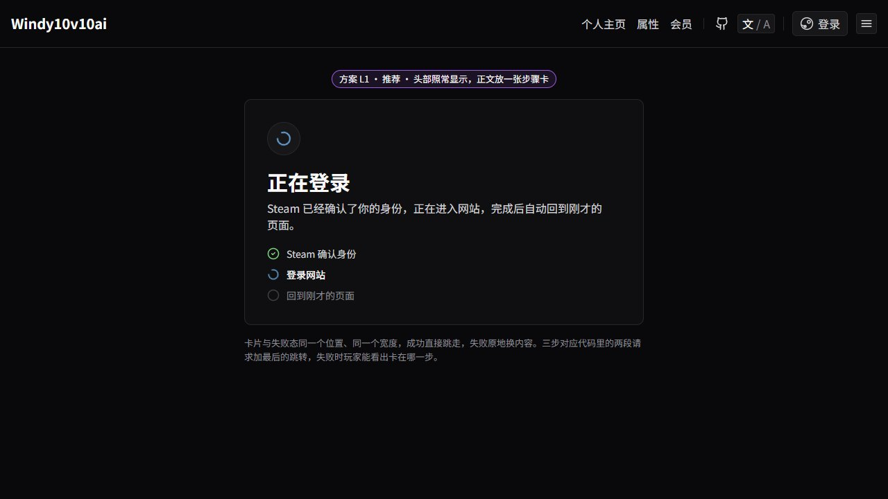
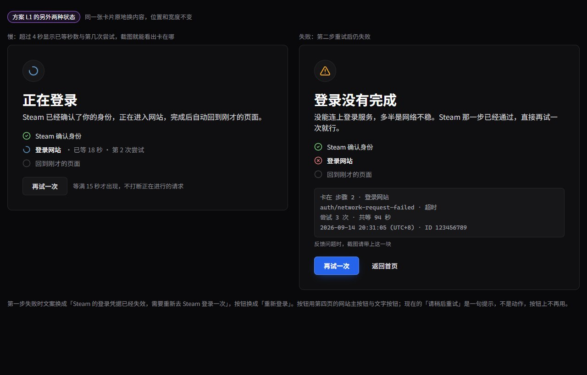
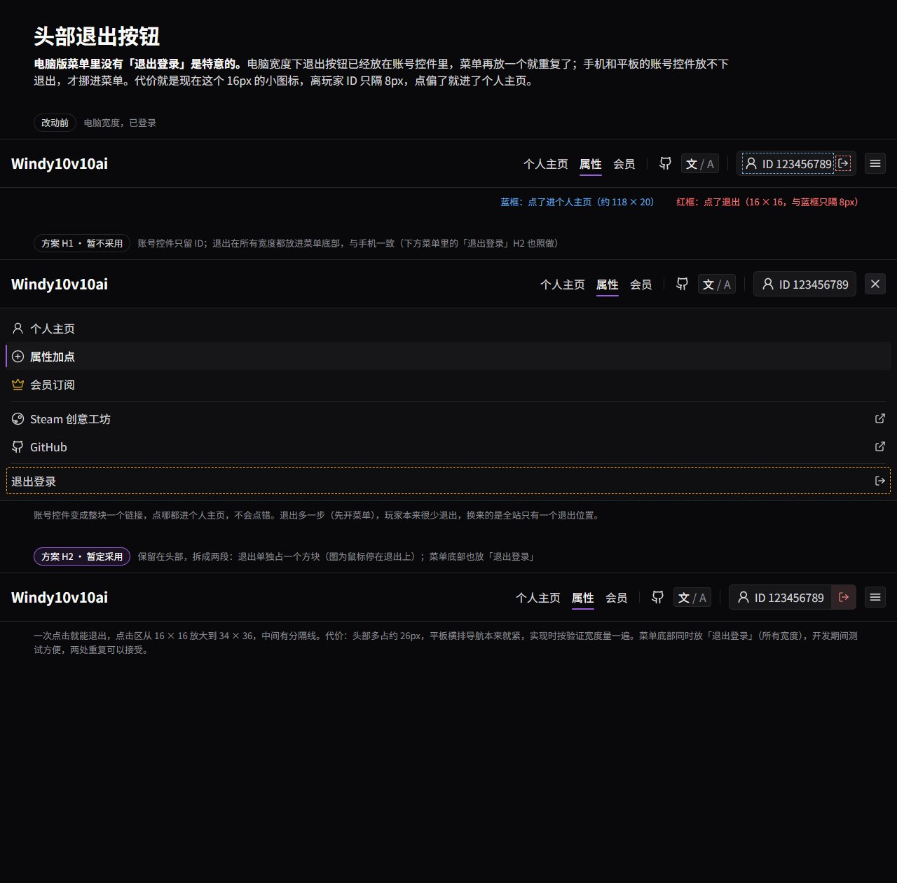
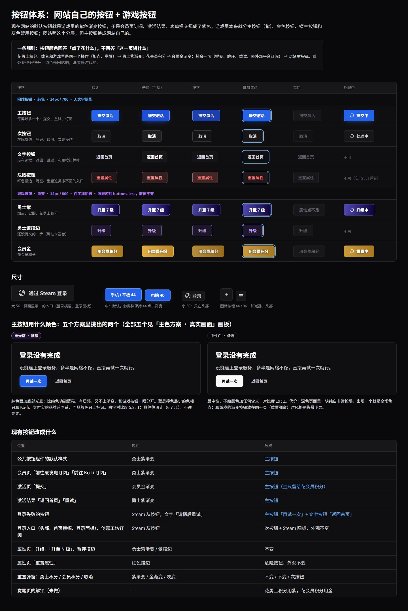

# 批次 12：按钮体系、登录等待与头部退出

> 状态：已完成。登录等待采用 L1；头部退出暂定 H2，菜单里也放退出；主按钮用电光蓝，见 [phase-12-color-system.md](phase-12-color-system.md)。

网站没有自己的一套控件语言：默认按钮借用了游戏的勇士紫渐变，加载与退出这些网站独有的流程也没有专门设计。颜色的分工见配色文档，本文只管控件。

## 1. 登录回调：不再整页遮罩

登录回调页只渲染 `Spinner`：`fixed inset-0` 盖一层 `bg-surface/85`，中间一个 48px 紫色转圈，「正在登录」只写在 `aria-label` 里。头部、底部被遮住，画面上没有任何文字。激活页提交时（`ManualActive`）用的是同一个组件。

**采用方案 L1：头部照常显示，正文放一张步骤卡。**

- 卡片与 `Notice` 同宽（576px），与失败态放在同一个位置：成功直接跳走，失败原地换内容，不换布局
- 标题「正在登录」，一句说明「Steam 已经确认了你的身份，正在进入网站，完成后自动回到刚才的页面」
- 三步：Steam 确认身份 → 登录网站 → 回到刚才的页面。前两步对应代码里的 `verify` 与 `signIn` 两段
- 失败态：按 `Failure.stage` 分两套文案与按钮。`signIn` 失败：「再试一次」（重用手上的 token）；`verify` 失败：「重新登录」（重走 Steam）。都配一个「返回首页」文字按钮
- 转圈用网站主色

方案 L2（未采用）：不用卡片，只在正文中间放转圈加两行字。改动最小，但慢和失败时说不清卡在哪一步，失败态要换成另一套布局。

**头部不遮住。** 遮罩存在的唯一好处是挡住头部的「登录」按钮；登录中途点它只是重新走一遍 Steam，不会出错，不值得为此遮掉整页。

**激活页提交不用整页遮罩**，改成提交按钮自己的「处理中」状态（`Button` 的 `loading`）。全屏 `Spinner` 组件随之删除。

### 等待与失败时给出排查信息

玩家「等不了」多半发生在转圈期间，失败页还没出现就关掉了，所以排查信息要在等待中就看得到，截图才有用。

- **等待超过 4 秒**：当前步骤后面显示已等秒数与第几次尝试，如「登录网站 · 已等 18 秒 · 第 2 次尝试」
- **等待超过 15 秒**：卡片底部出现次按钮。第二步卡住时是「再试一次」，并行开一轮新的登录，不打断正在进行的请求，谁先成功就跳走；第一步卡住时是「重新登录」，直接回 Steam
- **失败**：卡片里一块等宽小字，写明卡在第几步、错误码、错误细分、尝试次数、总耗时、发生时间（带时区）、玩家 ID（由 Steam 回调参数里的 64 位 ID 换算，第一步失败也拿得到），并提示反馈问题时截图带上这一块。发生时间与 ID 用来在生产日志里找到同一次登录

只看错误码分不出原因，需要细分：

| 情况 | 现在显示 | 改成 |
|---|---|---|
| 第一步 `fetch` 被拒（连不上接口、跨域失败） | `unknown` | `network` |
| 第一步接口一直不响应 | 无限转圈，没有错误 | 加 20 秒超时，显示 `timeout` |
| 第二步 SDK 超时 | `auth/network-request-failed` | 同码，细分「超时」：错误对象的 `customData.message` 为空 |
| 第二步连不上代理 | 同上 | 细分「连不上」：message 含 `Failed to fetch` |
| 第二步代理返回错误页 | 同上 | 细分「返回的不是 JSON」：message 是 JSON 解析错误 |

Firebase Auth SDK 每个请求在浏览器里超时 30 秒，超时、`fetch` 被拒、响应解析失败一律报 `auth/network-request-failed`。第二步有两个请求（`accounts:signInWithCustomToken` 与 `accounts:lookup`），加两次重试，最坏要 1.5–3 分钟才出失败页。SDK 的超时不能配置，所以靠显示已等时长、提前给出重试按钮，而不是去缩短超时。

## 2. 头部退出按钮

电脑宽度（≥ 1024）的账号控件是「人形图标 + ID」链接加一个 16px 退出图标，两者只隔 8px，退出的点击区只有 16 × 16，容易点偏进个人主页。

**电脑版菜单里没有「退出登录」是特意的**（phase-2g-header-layout.md）：电脑宽度退出已在账号控件里，菜单里藏掉免得两处重复；手机与平板的账号控件放不下退出，才挪进菜单。问题出在这个决定的代价上。

**暂定方案 H2，菜单里也放退出。** 开发期间要反复登录退出测试，一步就能退出更方便；两处重复可以接受。

- 电脑宽度：退出留在账号控件里，拆成独立的 34 × 36 方块，与 ID 之间加分隔线，悬停红底
- 菜单底部的「退出登录」去掉 `lg:hidden`，所有宽度都显示
- 代价：头部多占约 26px，768 的横排导航本来就紧，实现时按验证宽度量一遍

方案 H1（暂不采用）：账号控件只留 ID，退出只放菜单底部。全站只有一个退出位置、不会点错，但电脑上退出多一步。测试需求过去后可以再切到 H1。

## 3. 按钮体系

### 规则

**按钮颜色回答「点了花什么」，不回答「这一页讲什么」。**

| 操作 | 按钮 |
|---|---|
| 花勇士积分，或与游戏里是同一个操作（加点、觉醒） | 勇士紫渐变 `.btn-season`，暂存一步用 `.btn-season-outline` |
| 花会员积分 | 会员金渐变 `.btn-member` |
| 其余：提交、重试、跳转、去外部平台订阅或付款 | 网站主按钮 |
| 登录类的第三方入口（Steam） | 次按钮加品牌图标 |

外观上也分得开：**纯色是网站的，渐变是游戏的。** 游戏按钮取值照搬游戏仓库的 `buttons.less`，不变。

「会员相关就用金」不成立：会员页、激活页都跟会员有关，全用金就是把现在紫色的问题换成金色再来一遍。

游戏的 `buttons.less` 本来就分主按钮（紫）、金、镂空、灰色禁用四档，网站之前只照搬了紫和金，这里补齐网站自己的四档。

### 网站按钮

| 变体 | 默认 | 悬停 | 按下 | 用在 |
|---|---|---|---|---|
| 主按钮 | 网站主色，见配色文档第 3 节 | 同左 | 同左 | 每屏最多一个：提交、重试、订阅、付款 |
| 次按钮 | 底 `--color-control`、边 `--color-line`、字 `--color-content` | 底 `--color-control-hover`、边 `#3f3f46`、字 `--color-heading` | 底 `#141416` | 登录、取消、次要操作 |
| 文字按钮 | 透明、字 `--color-content` | 底 `--color-panel-soft`、字 `--color-heading` | 底 `#141416` | 返回、跳过，与主按钮并排 |
| 危险按钮 | 边 `danger/50`、底 `danger/8`、字 `--color-danger` | 底 `danger/15` | 底 `danger/22` | 重置这类撤不回的入口 |

共同规格：14px / 700、无文字阴影；圆角 7px；高度手机与平板 44、电脑 40；大号 56（登录横幅、登录面板）；头部 36。焦点框 2px 主色标记档、偏移 2px。禁用一律灰底灰字 `#5d5d66`。处理中：按钮内 16px 转圈，文字换成「提交中」这类进行时，宽度不变，同时禁用。

Steam 按钮就是次按钮加单色 Steam 图标，不做专属设计，理由见配色文档第 5 节。

### 现有按钮的归属

| 位置 | 现在 | 改成 |
|---|---|---|
| `Button` 默认 `variant` | `season` | 主按钮 |
| 会员页爱发电 / Ko-fi 订阅 | `.btn-season` | 主按钮 |
| 激活页提交 | `.btn-member` | 主按钮 |
| 激活结果「返回首页」「重试」 | `Button` 默认紫 | 主按钮 |
| 登录失败 | `steam` 变体，文字「请稍后重试」 | 主按钮「再试一次」/「重新登录」+ 文字按钮「返回首页」 |
| 登录入口、创意工坊订阅 | Steam 灰 | 次按钮 + Steam 图标，外观不变 |
| 属性页升级、暂存 | 紫渐变 / 紫描边 | 不变 |
| 属性页「重置属性」 | 红描边 | 危险按钮，外观不变 |
| 重置弹窗 | 紫 / 金 / 灰「取消」 | 不变 / 不变 / 次按钮 |
| 觉醒页解锁（未做） | — | 花勇士积分用紫，花会员积分用金 |

「请稍后重试」是提示不是动作，不再用作按钮文字。

## 4. 不做

- **不改游戏按钮的取值**。属性、觉醒页要与游戏内同名操作长得一样
- **不引组件库**。四种网站按钮仍是 `globals.css` 的几个类加 `Button` 的变体
