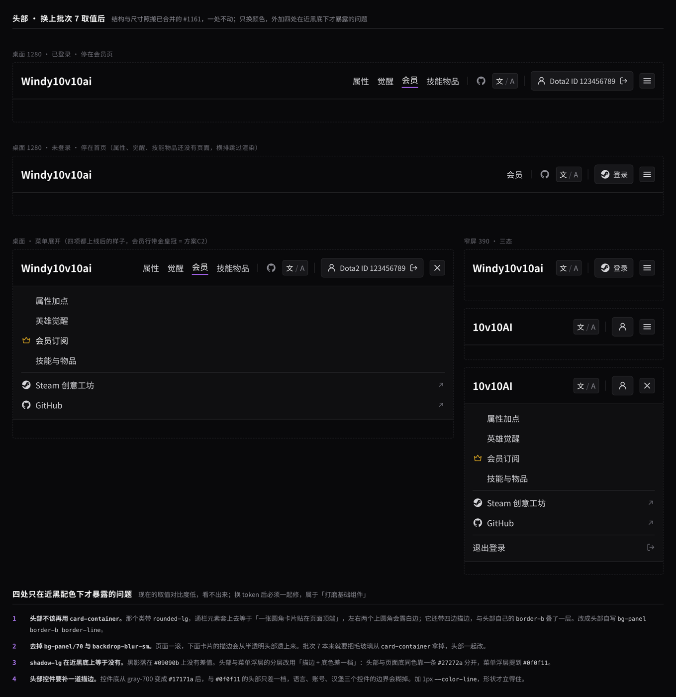
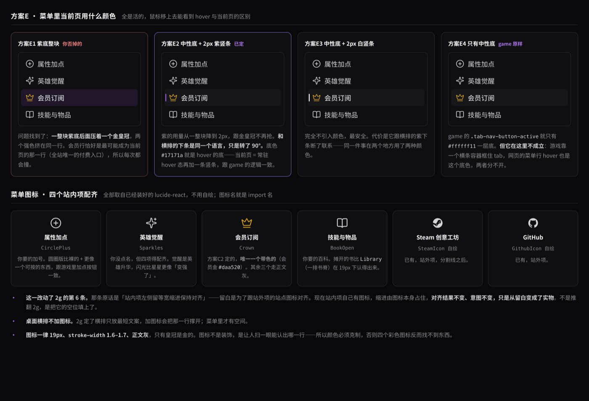
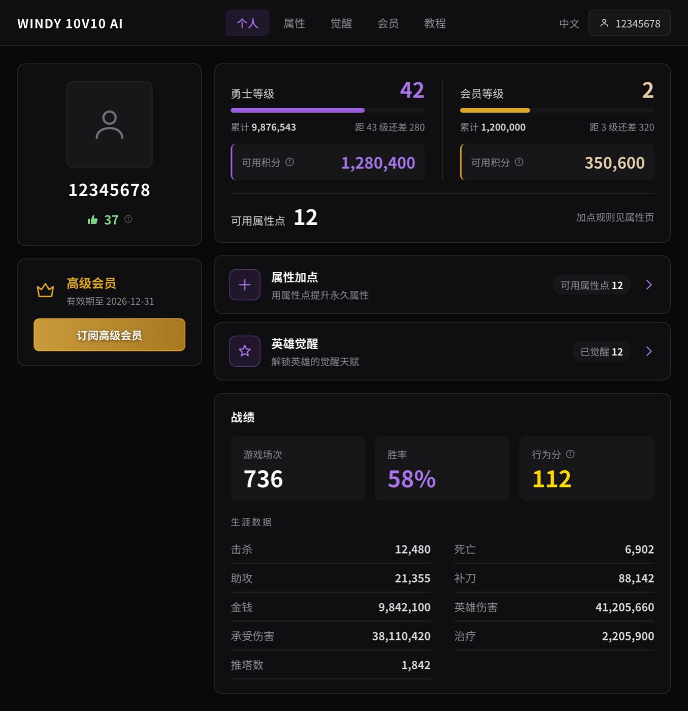
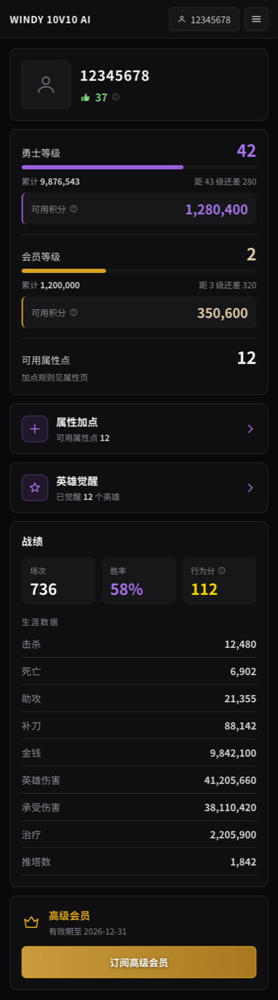
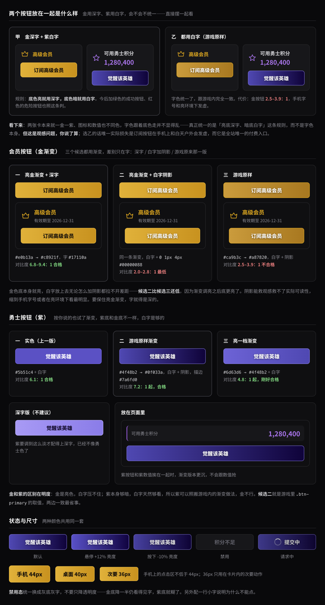

# 批次 7 视觉风格

> 总体规划见 [README.md](README.md)。这一批是三批页面（属性、觉醒、页面布局）的前置瓶颈，范围必须收住。

## 一句话结论

**底色保持中性深灰，强调色只用来分辨两套货币——勇士紫、会员金，标题跟着内容的归属着色，链接另用一档蓝，其余一律灰白；按钮与悬停动效照搬游戏内的取值；只改 `globals.css` 的 token 取值、字体、基础组件和头部的样式，不重构组件。**

## 1. 范围

做这些：

- `web/app/globals.css` 的 `@theme` token 取值与新增
- 字体
- `web/app/components/ui/` 下已有的 Button、Input、Field、Spinner，以及 `card-container` 等几个工具类的样式
- 新增按钮变体（会员金、勇士紫）
- **头部的配色、悬停与当前页标记**（第 5 节）。结构与尺寸是批次 2g 的产出，已随 [#1161](https://github.com/windy10v10ai/firebase/pull/1161) 合并，这一批一个像素都不动，只换颜色、补当前页标记和菜单图标

不做这些：

- 不重构任何组件的结构与 props
- 不调整现有页面的排版（首页、会员页的排版是批次 8）
- 不新增页面
- **tooltip 与进度条不在这一批落地。** 两者眼下没有调用方，先写进仓库就是一份没人用、也没法在浏览器里验的代码；规格已经记在第 6 节，批次 3a 和批次 8 用到时按那里建，建完即有调用方可验。

**个人主页的结构重排不在这一批。** 设计过程中把个人主页重新排了（左栏玩家卡、积分与等级卡、可点入口行、战绩分两层），那是页面结构改动，按 README 的划分属于批次 8。这一批只把颜色和按钮换掉，个人主页保持现有的三张卡片不动。下面的截图是重排之后的完整形态，作为批次 8 的输入。

## 2. 颜色

### 底色与文字

| token | 取值 | 用途 |
|---|---|---|
| `--color-surface` | `#09090b` | 页面底色 |
| `--color-panel` | `#0f0f11` | 卡片、头部 |
| `--color-panel-soft` | `#17171a` | 卡片内的嵌入块（数值块、tag、输入框底） |
| `--color-line` | `#27272a` | 描边与分隔线 |
| `--color-heading` | `#fafafa` | 标题、主数值 |
| `--color-content` | `#d4d4d8` | 正文 |
| `--color-muted` | `#8b8b93` | 标签、说明、次要信息 |

`--color-panel-soft` 是新增的。现有的 `--color-control` / `--color-control-hover` 取值改成 `#17171a` / `#1f1f23`，名字不动。

### 勇士与会员

**强调色只干一件事：分辨两套货币。** 勇士（等级、积分、进度条、相关入口）一律紫，会员（等级、积分、皇冠、订阅、头像徽章）一律金。新增页面照这条判，不要再引入第三种强调色——下面的链接蓝和状态色都不是强调色，各有各的固定职责，不用来表示归属。

| token | 取值 | 用途 |
|---|---|---|
| `--color-season` | `#a874ea` | 勇士的数值与文字 |
| `--color-season-strong` | `#9b5de0` | 勇士的进度条、填充、左侧色条 |
| `--color-season-soft` | `rgba(155, 93, 224, 0.12)` | 勇士图标底、导航高亮底 |
| `--color-season-border` | `rgba(155, 93, 224, 0.4)` | 勇士图标描边 |
| `--color-member` | `#e0caa5` | 会员的数值 |
| `--color-member-strong` | `#daa520` | 会员的标题、皇冠、进度条、描边 |
| `--color-member-soft` | `rgba(218, 165, 32, 0.11)` | 会员图标底 |
| `--color-member-border` | `rgba(218, 165, 32, 0.4)` | 会员图标描边 |

紫的两档取自游戏内 season point 的 `#9b5de0`，文字档提亮到 `#a874ea` 才够对比度；金的两档就是游戏的 `@color-gold` 与 `@color-gold-muted`。

现有的 `--color-accent` 系列保留名字，取值指向勇士紫，这样已经写了 `text-accent` 的组件不用改：

| token | 取值 |
|---|---|
| `--color-accent` | `#a874ea` |
| `--color-accent-hover` | `#bda0f0` |
| `--color-accent-solid` | `#4f48b2` |
| `--color-accent-solid-hover` | `#5f57c8` |

### 标题

**标题跟着内容的归属着色**，不是一律白也不是一律金：

| 内容 | 标题色 |
|---|---|
| 会员相关（会员页、会员卡、激活页、订阅平台） | `--color-member-strong` |
| 勇士相关（属性页、觉醒页，以及将来一切花勇士积分的页面） | `--color-season` |
| 其余（首页、战绩、商业披露、通用卡片） | `--color-heading` |

game 里标题一律金（`dialog.less` 的 `.title`、tab 当前项都是 `@color-gold`）。网站不能照搬：金在这里已经等于会员，全站标题变金，金皇冠和金订阅按钮就失去了识别作用。折中成「标题跟内容走」，层级和归属都保住。

标题一律白也不行——那样层级只剩字号一档，卡片一多就分不出主次。

### 链接

| token | 取值 | 用途 |
|---|---|---|
| `--color-link` | `#6aa9e0` | 正文内联链接 |
| `--color-link-hover` | `#8dc2ef` | 内联链接悬停、导航类链接悬停 |

**链接不用紫。** 紫在这里等于勇士积分，紫色的「爱发电」链接会被读成跟积分有关；链接是功能，与归属无关，所以单开一档蓝，既不属于勇士也不属于会员。

两种用法分开：

- **正文内联链接**（`.link-inline`）：静止就是蓝的，否则在整段文字里认不出来可点
- **导航类链接**（`.link-hover`，品牌名、页脚、账号控件）：静止中性，悬停才变蓝。横排导航项仍然是例外，见第 5 节

**赞助平台用各自的品牌色**，只用在平台名和指向该平台的链接上：

| token | 取值 | 平台 |
|---|---|---|
| `--color-afdian` | `#946ce6` | 爱发电 |
| `--color-kofi` | `#29abe0` | Ko-fi |

会员页上两张平台卡并排，标题带品牌色比两个都染成会员金更好认，链接同理。价格仍是米金、订阅按钮仍是金渐变，「这是会员的东西」由这两处承担。

两个取值都取自 game 的 `src/panorama/react/hud_main/pages/profile/tabs/member/styles.less`，游戏内用在平台卡描边和平台描述行上，网站改用在平台名和链接上。

Ko-fi 的蓝 `#29abe0` 与链接蓝 `#6aa9e0` 同色系，靠饱和度分开；两者不会出现在同一行。爱发电的紫 `#946ce6` 与勇士紫 `#a874ea` 很接近。会员页上没有勇士内容，撞不到；但品牌色只许出现在这两个平台自己的元素上，别的地方一概不用，否则紫就分不清是积分还是赞助平台了。

### 状态色

| 用途 | 取值 |
|---|---|
| 正向、点赞、治疗 | `#7fd47f` |
| 危险、举报、死亡 | `#e87d7d` |
| 警告 | `#f5a623` |
| 行为分满档 | `#ffd700` |

行为分按游戏内的分段着色，取值与 `StatsTab.tsx` 一致：≥110 金、80–109 绿、60–79 橙、<60 红。

## 3. 字体

正文 `'Noto Sans SC', system-ui, sans-serif`，字重只加载 400 / 500 / 700。数字一律加 `font-variant-numeric: tabular-nums`，否则等宽对不齐，积分和战绩会跳。

两处与 README 的原计划不同：

- **去掉 Inter。** 中文本来就落到系统字体，留着它只多一次请求。
- **不加衬线标题字。** README 原写「Noto Sans SC 加一个衬线标题字体」，实际做下来层级靠字号和颜色已经分得开；中文衬线（Noto Serif SC）体积大，气质也不像游戏界面。

Noto Sans SC 全量很大，用 `next/font` 按子集加载，`display: swap`。

## 4. 按钮

两种颜色，都照搬游戏内 `src/panorama/react/shared/styles/buttons.less` 的取值，白字加一层黑影。

| 变体 | 底 | 描边 | 字 |
|---|---|---|---|
| 会员（金） | `linear-gradient(90deg, #ca9b3c, #a87820)` | `#daa520` | `#ffffff` + `text-shadow: 0 1px 4px rgba(0,0,0,0.53)` |
| 勇士（紫） | `linear-gradient(90deg, #4f48b2, #0f033a)` | `#7a6fd0` | 同上 |
| 爱发电 | `linear-gradient(90deg, #946ce6, #3d2a66)` | `#a98bec` | 同上 |
| Ko-fi | `linear-gradient(90deg, #29abe0, #0d3d52)` | `#5cc3ea` | 同上 |
| 次要 | 透明 | `--color-line` | `--color-content` |
| 禁用 | `--color-panel-soft` | `--color-line` | `#5d5d66` |

尺寸与状态：

| 项 | 值 |
|---|---|
| 高度 | 手机 44px、桌面 40px、卡片内次要动作 36px |
| 圆角 | 7px（36px 的用 6px） |
| 字号 | 14px / 800 字重 |
| 悬停 | `filter: brightness(1.12)` |
| 按下 | `filter: brightness(0.9)` |
| 禁用 | 换成灰底灰字，不要只降透明度——金底降一半仍看得见字，紫底会糊；另配一行小字说明为什么不能点 |

渐变没法进 Tailwind 的 `@theme`，在 `@layer components` 里写成 `.btn-member` / `.btn-season` / `.btn-afdian` / `.btn-kofi` 四个类。

**会员页的两个订阅按钮用平台自己的品牌色，不用会员金。** 两块金砖并排、上面还压着金标题，一屏里金出现四次，反而看不出重点在哪；各自品牌色让两张卡自成一体，「这是会员的东西」交给金标题和米金价格。渐变按 game 的做法从品牌色压到同色深档。

### 对比度：一处明知不达标的取舍

金色按钮的白字对比度是 **2.5–3.9 : 1**，低于 WCAG AA 对 14px 粗体要求的 4.5 : 1。深色字能到 6.8–9.4 : 1，但那样金按钮用深字、紫按钮用白字，两个按钮不一致。

两个平台按钮同理：白字在渐变亮端是爱发电 3.79 : 1、Ko-fi 2.63 : 1，暗端都在 11 : 1 以上。

**决定：接受不达标，所有渐变按钮都用白字，与游戏内保持一致。** 记在这里是为了将来有人提无障碍问题时知道这是权衡结果而不是疏忽。实际影响是订阅按钮在手机字号和强光下会发虚，而它是全站唯一的付费入口——如果以后收到反馈，第一个要改的就是它，改法是把字换成 `#17110a`。

紫色按钮没有这个问题：紫本身够暗，白字是 7.2 : 1，合格。

## 5. 头部

结构与尺寸照搬 [phase-2g-header-layout.md](phase-2g-header-layout.md)，这一批只改下面这些。

### 五处取舍

设计时每处都比过几个方案，画布里留着对比件。这里只记结论与理由。

| | 决定 | 为什么不选别的 |
|---|---|---|
| **方案A3** 当前页高亮 | 文字提白 + 2px 紫下条，下条贴文字底而不是头部底边 | 做成紫底胶囊（A1）会跟旁边的语言、账号两个真按钮混成一类；中性底（A2）在近黑头部上几乎看不见 |
| **方案B2** 头部底色 | 头部与页面底同色 `--color-surface`，靠一条 `--color-line` 分开 | 头部若用 `--color-panel`（B1），就跟页面里的卡片同一档，两者成了并列的面板，头部压不住页面 |
| **方案C2** 会员入口 | 菜单里的会员行带金皇冠，桌面横排保持中性 | 横排也变金（C3）会有一项永远是亮的，跟当前页标记抢戏；全中性（C1）则让全站唯一的付费入口淹在列表里 |
| **方案D3** 悬停动效 | 文字不动，一条半透明紫下条从文字下方 4px 滑上来并淡入 | 整项上移（D2）会让被悬停那一项的基线比旁边高 2px，一行字里有一个字浮起来；下条在项之间滑动（D4）纯 CSS 做不了，要 JS 量宽度或引 framer-motion |
| **方案E2** 菜单当前行 | 中性底 `--color-panel-soft` + 左侧 2px 紫竖条 | 整行紫底（E1）后面压着金皇冠，两个强色挤在同一行——而会员行恰好最可能成为当前页 |

### 悬停与当前页

取值照搬 game 的 `src/panorama/react/shared/styles/tab-navigation.less`：悬停只动亮度不动色相，时长 `@transition-fast` 0.15s、`ease-out`。

| 元素 | 静止 | 悬停 | 当前页 |
|---|---|---|---|
| 横排导航项 | `--color-content` | 文字 `--color-heading`；下条 `--color-season-strong` 从 `translateY(4px)` 滑到 0、透明度 0 → 0.55 | 文字 `--color-heading`；下条不透明、`translateY(0)` |
| 菜单行 | `--color-content` | 底 `--color-panel-soft`、文字 `--color-heading` | 同悬停，再加左侧 2px `--color-season-strong` 竖条 |
| 汉堡按钮 | `--color-panel-soft` | `--color-control-hover` | 不标当前页 |

三条跟着来的规则：

- **当前页悬停无变化。** 它已经是终点，点了还在这一页。game 里 active 与 hover 用同一个底色 `#ffffff11`，就是这个意思——当前页 = 常驻的悬停态。
- **横排导航项是 `link-hover` 的例外**：悬停提亮到 `--color-heading`，不变紫。紫在那一行已经归当前页的下条用了，悬停再变紫，相邻两项一个白字紫条、一个紫字，扫一眼分不清哪个是当前页。品牌名、菜单行悬停变链接蓝，正文内联链接静止就是蓝的，见第 2 节。
- **汉堡按钮不标当前页**：它是「打开菜单」的开关，不是导航项；窄屏下它是唯一入口，永远高亮等于永远不高亮。
- `prefers-reduced-motion: reduce` 下把上面所有过渡时长归零。

**窄屏的位置提示只在菜单里。** 下条长在横排上，而窄屏把横排整体收起来了。收起时不补页面名——375 那一行量下来只剩 13px 余量，塞不下；手机上页面标题本来就在头部正下方第一行。

### 菜单图标

四个站内项配齐，全部取自已装好的 `lucide-react`，图标名即 import 名。

| 项 | 图标 | 颜色 |
|---|---|---|
| 属性加点 | `CirclePlus` | `--color-content` |
| 英雄觉醒 | `Sparkles` | `--color-content` |
| 会员订阅 | `Crown` | `--color-member-strong` |
| 技能与物品 | `BookOpen` | `--color-content` |
| Steam 创意工坊 / GitHub | 已有的 `SteamIcon` / `GithubIcon` | `--color-content` |

一律 19px、`stroke-width` 1.6–1.7。**只有皇冠带色**——图标是让人扫一眼认出哪一行的，四个都上色反而找不到东西。桌面横排不加图标，2g 定了横排只放最短文案。

这一条把 2g 第 6 条的「站内项左侧留等宽缩进」从留白换成了图标本身。缩进宽度、对齐结果都不变，2g 的意图（站内外对齐）也不变。

### 四处要一起修的

现在的取值对比度低，这些问题看不出来；换成近黑配色后会暴露。

| # | 问题 | 改法 |
|---|---|---|
| 1 | 头部套着 `card-container`，那个类带 `rounded-lg`，通栏元素套上去左右两个上圆角会露出来；它的四边描边还与头部自己的 `border-b` 叠了一层 | 头部不再用 `card-container`，自写 `bg-surface border-b border-line` |
| 2 | `bg-panel/70` + `backdrop-blur-sm`：页面一滚，下面卡片的描边会从半透明头部透上来 | 去掉，用不透明底色。`card-container` 的毛玻璃本来就要在这一批拿掉 |
| 3 | `shadow-lg` 在近黑底上没有差值，等于没做 | 头部与菜单浮层的分层改用「描边 + 底色差一档」：头部靠 `--color-line` 与页面分开，菜单浮层提到 `--color-panel` |
| 4 | 控件底变成 `--color-panel-soft` 后与头部只差一档，语言、账号、汉堡三个控件的边界会糊 | 三个控件补 1px `--color-line` 描边 |

### 不做的

- **登录按钮保持中性灰**，不做成紫色或金色主按钮。紫和金是货币色，Steam 登录入口染上任何一种都会被读成「跟积分有关」；它靠 36px 高度和最右位置已经够显眼。
- **不引任何组件库。** 上面整节加起来十来行 CSS。头部刚在 #1161 重做完，这一批的范围是「不重构组件」。
- **横排的滑动指示器不做**（方案D4），桌面横排现在只有「会员」一项可见。

## 6. 其余组件

| 组件 | 规格 |
|---|---|
| 卡片 | `--color-panel` 底 + 1px `--color-line` 描边 + 10px 圆角 + 18px/20px 内边距；去掉现在的 `backdrop-blur` 和 hover 位移 |
| 嵌入块 | `--color-panel-soft` 底 + 7px 圆角；属于某套货币时左边加 2px 对应色条 |
| 进度条 | 高 6px、圆角 3px，槽 `--color-panel-soft`，填充用货币色的 strong 档 |
| 数据行 | 标签 `--color-muted` 左对齐，数值 700 字重右对齐，行间 1px `--color-line` |
| tooltip | `#1c1c20` 底 + 1px `#3a3a40` 描边 + 8px 圆角 + 12.5px/1.65 行高，最宽 340px |
| 可点入口行 | 整行卡片，左图标、中标题与说明、右数量 tag 和箭头；箭头用 `--color-season` |

## 7. 应用效果

结构是批次 8 的形态，颜色和按钮是这一批的产出。

### 个人主页（桌面）

### 个人主页（手机 390 宽）

### 按钮

设计过程与被否掉的六个方向留在画布里：<https://claude.ai/code/artifact/1bf27965-f2fa-4091-9fba-191331419108>（需要登录 claude.ai 且在组织内才能打开，所以规格以本文为准，链接只当过程记录）。

## 8. 这一批之外的几条结论

设计过程中确认的，做后面几批时要按这个写，不要写反：

- **属性加点花的是属性点**，属性点 = 勇士等级 + 会员等级（接口的 `totalLevel`），可用属性点是 `useableLevel`。洗点才消耗会员积分。
- **可用积分用于永久觉醒英雄**，会员积分还能刷新抽奖。觉醒一个英雄要勇士积分 8000 或会员积分 4000。
- **累计积分只增不减**，决定等级与属性点；花费只减可用。这两句的文案直接用游戏的 `profile_point_season_tooltip` 与 `profile_point_member_tooltip`，不要另写。
- **累计积分和等级进度的字段接口已经在返**：`seasonPointTotal`、`memberPointTotal`、`seasonCurrrentLevelPoint`（后端原拼写，三个 r）、`seasonNextLevelPoint`、`totalLevel`、`useableLevel`，只是 `web/app/lib/player-info.ts` 的类型没声明，加上即可，后端不用改。
- **会员状态**：`member.level` 为 1 显示「普通会员」，≥2 显示「高级会员」；没有 `member` 字段时整张卡不渲染，订阅入口走顶部菜单；订阅按钮一律指向高级会员。
- **积分最多考虑 7 位数**，数值容器要 `white-space: nowrap`，不能靠换行兜底。

## 9. 测试清单

- [ ] `cd web && npm run lint && npx tsc --noEmit && npm run build`
- [ ] 按 [web/CLAUDE.md](../../../web/CLAUDE.md) 的三档宽度（375 / 768 / 1280）逐页看首页、会员页、个人主页、激活页，确认无横向滚动、头部元素不接触
- [ ] 头部四态实测：未登录 / 已登录 × 桌面 / 窄屏，菜单展开与收起各一次
- [ ] 停在 `/membership` 时，桌面横排的「会员」有紫下条、菜单里的「会员订阅」有紫竖条；停在首页时两处都没有
- [ ] 悬停横排导航项，文字提亮到白**且不变紫**，下条从下方滑入；悬停当前页无变化
- [ ] 开系统的「减弱动态效果」后重看一遍，过渡时长为 0
- [ ] 正文与标签的对比度实测 ≥ 4.5 : 1；按钮对比度记录实测值，金色按钮的偏低是已知取舍
- [ ] 改动前后的截图对比进 PR 正文

## 10. 待办

- 头像要等批次 9 拿到 Steam Web API key，现在是占位图标，不加会员金边（游戏里加金边是为了区分会员，网站不需要）。
- 觉醒入口右边的「已觉醒 12」要多带一个 `include=heroAwakening`，多读一次 Firestore。做觉醒页时一并决定要不要。
- **Tooltip 值得引 Radix Tooltip 或 `@floating-ui/react`**，不要手写。手写的容易在这四件事上翻车：靠近视口右边要自动往左翻、手机上没有悬停只能点、键盘焦点与 Esc 关闭、页面滚动时跟随。本批先用最简单的实现顶上，引库单独一个 PR。
- **批次 3a 开工前要决定要不要上 shadcn/ui。** 现在 `web/app/components/ui/` 下只有 button、field、input、spinner 四个手写件，属性、觉醒、技能与物品三页要用到 Tabs、Dialog、Select、Progress、Tooltip。三页各自手写一遍，仓库里就会有三套不一样的 Dialog。shadcn 是把源码复制进仓库、不是加依赖，能与现有手写件共存、逐个替换。这不属于本批，但拖到三页开工后再决定就晚了。
