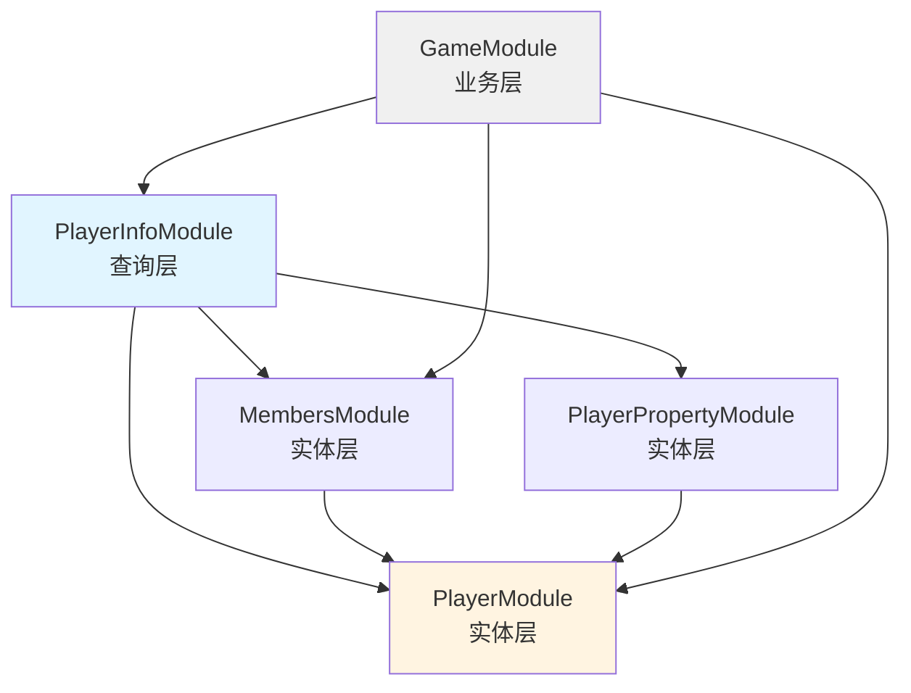

# 架构设计文档

## 整体架构

### 三层架构设计

```
┌─────────────────────────────────────────────────┐
│  业务层 (Business Layer)                        │
│  GameModule, AdminModule, AfdianModule, ...    │
│  使用 PlayerInfoService 获取数据                 │
└─────────────────────────────────────────────────┘
                    ↓
┌─────────────────────────────────────────────────┐
│  查询层 (Query Layer)                            │
│  PlayerInfoModule                                 │
│  - PlayerInfoService (DTO 构建)                 │
│  - PlayerInfoController (查询 API)               │
└─────────────────────────────────────────────────┘
                    ↓
┌─────────────────────────────────────────────────┐
│  实体层 (Entity Layer)                           │
│  PlayerModule, MembersModule, PlayerPropertyModule│
│  负责实体的 CRUD 操作                             │
└─────────────────────────────────────────────────┘
```

## 模块职责划分

### PlayerInfoModule (查询层) ⭐ 核心

**职责**：
- DTO 构建和查询
- 提供统一的查询 API

**文件结构**：
```
api/src/player-info/
├── player-info.module.ts          # 模块定义
├── player-info.service.ts          # DTO 构建服务
├── player-info.controller.ts       # 查询 API 端点（第二阶段）
└── dto/
    └── player-info.dto.ts          # PlayerInfoDto 定义（第二阶段）
```

**依赖**：
- PlayerModule (需要 PlayerService, PlayerSettingService)
- MembersModule (需要 MembersService)
- PlayerPropertyModule (需要 PlayerPropertyService)

**导出**：
- PlayerInfoService (供业务层使用)

### PlayerModule (实体层)

**职责**：
- Player 实体的 CRUD 操作
- PlayerSetting 管理
- PlayerRanking 管理

**注意**：不导入 PlayerInfoModule，避免循环依赖

### MembersModule (实体层)

**职责**：
- Member 实体的 CRUD 操作
- 会员业务逻辑（创建、续费、转换等）

**依赖**：
- PlayerModule (MembersService 需要 PlayerService 处理积分)

### GameModule (业务层)

**职责**：
- 游戏业务逻辑
- 游戏开始/结束处理
- 活动奖励处理

**依赖**：
- PlayerInfoModule (使用 PlayerInfoService)
- MembersModule
- PlayerModule
- EventRewardsModule
- AnalyticsModule

**注意**：不再直接依赖 PlayerPropertyModule（通过 PlayerInfoModule 间接获取）

## 依赖关系图

### 模块依赖



### 服务依赖

```
PlayerInfoService
├── PlayerService (PlayerModule)
├── PlayerSettingService (PlayerModule)
├── PlayerPropertyService (PlayerPropertyModule)
└── MembersService (MembersModule)

GameService
├── PlayerInfoService (PlayerInfoModule) ⭐
├── PlayerService (PlayerModule)
├── MembersService (MembersModule)
├── EventRewardsService
└── SecretService
```

## API 端点分布

### `/player` 路径下的端点

| 端点 | Controller | 模块 | 说明 |
|------|-----------|------|------|
| `GET /player/ranking` | PlayerController | PlayerModule | 获取排行榜 |
| `GET /player/:id/setting` | PlayerController | PlayerModule | 获取玩家设置 |
| `PUT /player/:id/setting` | PlayerController | PlayerModule | 更新玩家设置 |
| `GET /player/:steamId/info` | PlayerInfoController | PlayerInfoModule | 获取玩家完整信息 ⭐ 第二阶段新增 |

### `/game` 路径下的端点

| 端点 | Controller | 模块 | 说明 |
|------|-----------|------|------|
| `GET /game/player/steamId/:steamId` | GameController | GameModule | 获取玩家信息（兼容端点，返回 PlayerDto） |

## 关键设计决策

### 1. 为什么 Controller 放在 PlayerInfoModule 中？

**原因**：
- 避免循环依赖（PlayerModule ↔ PlayerInfoModule）
- 职责清晰（查询相关的 Controller 和 Service 在同一个模块）
- API 路径仍然可以统一在 `/player` 下

### 2. 为什么保持 MembersModule → PlayerModule 的依赖？

**原因**：
- 创建会员时需要添加积分，这是业务规则
- 应该在 MembersService 中封装，保证原子性
- 这是单向依赖，不会形成循环

### 3. 为什么 GameModule 不再直接依赖 PlayerPropertyModule？

**原因**：
- 通过 PlayerInfoModule 间接获取 PlayerPropertyService
- 减少 GameModule 的直接依赖
- 依赖关系更清晰
