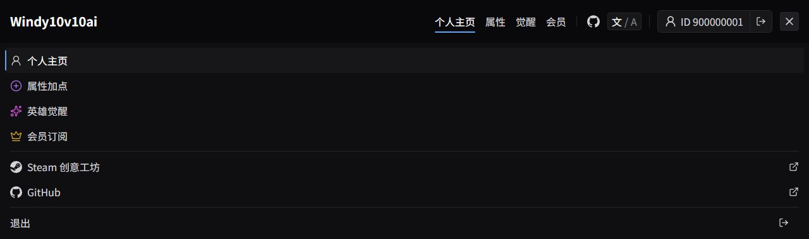
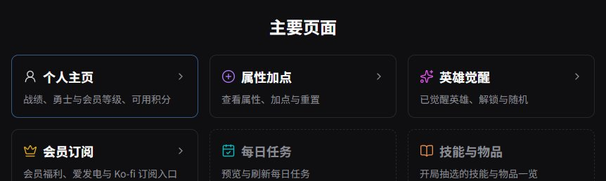
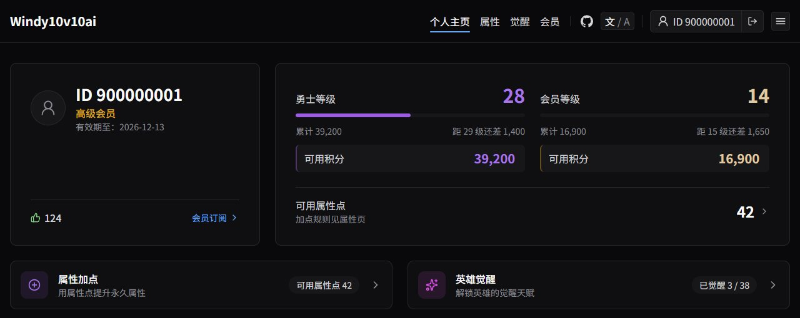
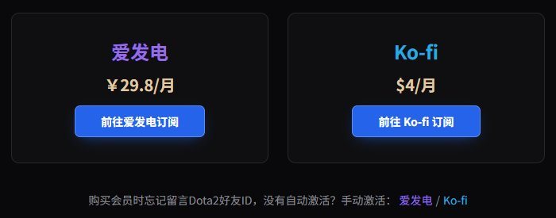
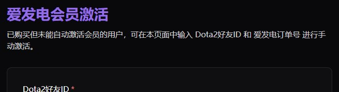
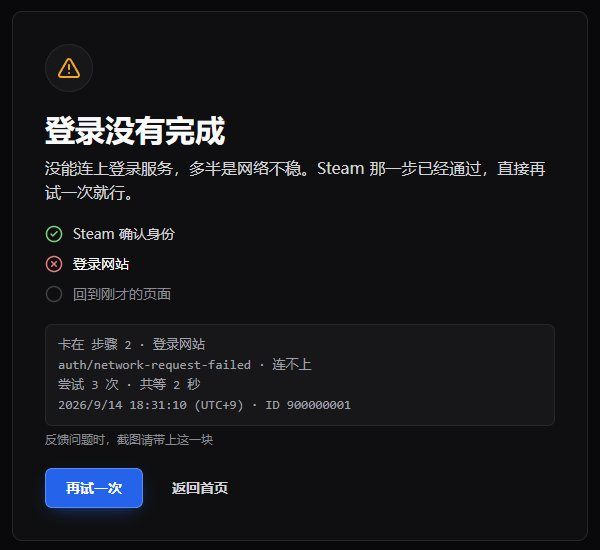
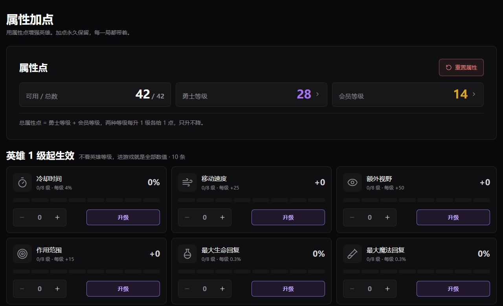

# 网站视觉规范：配色、按钮与可点击元素

> 本文是网站长期有效的视觉规范：颜色怎么分工、取什么值，按钮怎么选，能点的东西长什么样。只在规范变更时更新，不因批次完成而增删。各项决定的来由见批次文档 [phase-11-clickable-polish.md](../design/web/phase-11-clickable-polish.md)、[phase-12-color-system.md](../design/web/phase-12-color-system.md)、[phase-12-controls.md](../design/web/phase-12-controls.md)；写代码时照着做的规约见 [web/CLAUDE.md](../../web/CLAUDE.md)「可点击元素」「颜色」「按钮」。
>
> 取值的真相源是 `web/app/globals.css` 的 `@theme`，本文与它不一致时以代码为准，并回来改本文。

## 一句话结论

**每种颜色只管一件事。** 紫与金只表示勇士与会员两套货币；「能点」由网站自己的主色（电光蓝）表达；每个功能有自己的图标色；第三方平台的品牌色只留在它们自己的标识上。按钮颜色回答「点了花什么」：纯色是网站自己的按钮，渐变是与游戏一致的花积分按钮。

## 1. 配色分工

| 颜色 | 管什么 | 不用在 |
|------|------|------|
| 中性灰 | 底色、卡片、分隔线、正文、次按钮 | — |
| 网站主色 | 主按钮；它的标记档管链接、当前页标记、可点击卡片的悬停描边、焦点框、转圈 | 数值、标题 |
| 勇士紫 | 勇士等级与积分、属性卡进度条、花勇士积分或与游戏同名操作的按钮、勇士相关标题 | 交互反馈、通用按钮 |
| 会员金 | 会员等级与积分、皇冠、花会员积分的按钮、会员相关标题 | 交互反馈、通用按钮 |
| 功能色 | 各功能的图标与图标底块 | 数值、按钮、标题、箭头 |
| 品牌色 | 第三方平台自己的标识 | 按钮、描边、悬停、数值 |
| 状态色 | 成功、危险、警告 | 装饰 |

**为什么这样分**：紫色曾经同时是勇士积分色、全站交互色和默认按钮色，每一页都满是紫，玩家分不清哪块紫在说积分、哪块在说「能点」。一种颜色只承担一种含义，含义才读得出来。

## 2. 取值

### 中性与货币

| token | 取值 | 用途 |
|------|------|------|
| `--color-surface` | `#09090b` | 页面底色 |
| `--color-panel` | `#0f0f11` | 卡片、头部 |
| `--color-panel-soft` / `--color-control` | `#17171a` | 嵌入块、控件底 |
| `--color-control-hover` | `#1f1f23` | 控件悬停 |
| `--color-line` | `#27272a` | 描边与分隔线 |
| `--color-heading` / `--color-content` / `--color-muted` | `#fafafa` / `#d4d4d8` / `#8b8b93` | 标题 / 正文 / 次要 |
| `--color-season` / `-strong` | `#a874ea` / `#9b5de0` | 勇士文字 / 填充；`-soft`、`-border` 为 12%、40% 透明 |
| `--color-member` / `-strong` | `#e0caa5` / `#daa520` | 会员数值 / 标题与填充；`-soft`、`-border` 为 11%、40% 透明 |

勇士紫取自游戏的 season point 色，金取自游戏的 `@color-gold` 与 `@color-gold-muted`。

### 网站主色（电光蓝）

| token | 取值 | 用途 |
|------|------|------|
| `--color-primary` | `#2563eb` | 主按钮底 |
| `--color-primary-hover` / `-active` | `#1d4ed8` / `#1e40af` | 悬停 / 按下 |
| `--color-primary-border` / `-border-hover` | `#5b8cf5` / `#6b95f7` | 描边 |
| `--color-primary-glow` | `rgba(37, 99, 235, 0.75)` | 按钮下方光晕 |
| `--color-link` / `-hover` | `#60a5fa` / `#93c5fd` | 标记档：链接、当前页标记、焦点框、转圈 |
| `--color-link-border` | `rgba(96, 165, 250, 0.5)` | 可点击卡片悬停描边 |

- 白字在默认、悬停、按下三种底上的对比度为 5.2 / 6.7 / 8.7 : 1。**悬停往深走不往亮走**，亮一档白字就掉到 AA 以下
- **光晕放在按钮下方，不做渐变**。渐变是游戏按钮的识别特征，网站按钮靠纯色面加光晕与之区分
- 链接与交互标记共用一档蓝，页面上只有一种蓝
- 选蓝是因为它撞色最少：会撞的只有 Ko-fi、支付宝，而品牌色只上标识。白在深色页面里太抢眼，青与绿各自会挤掉每日任务色和「绿 = 成功」

### 功能色

| 功能 | token | 取值 | 对 `--color-panel` 对比度 |
|------|------|------|------|
| 属性加点 | `--color-feature-property` | 引用 `--color-season`（`#a874ea`） | 5.8 : 1 |
| 英雄觉醒 | `--color-feature-awaken` | `#dd53e7` | 5.9 : 1 |
| 每日任务 | `--color-feature-daily` | `#04bbc3` | 8.1 : 1 |
| 技能与物品 | `--color-feature-wiki` | `#e28d4f` | 7.4 : 1 |
| 预留 1 | 上线时新增 | `#3fbe90` | 8.2 : 1 |
| 预留 2 | 上线时新增 | `#7ca2f6` | 7.6 : 1 |

每个都有同色 12% 透明的 `-soft`，给图标底块用。

- **只上图标与图标底块**，数值、按钮、标题、箭头不跟；首页卡片、头部菜单、个人主页入口卡三处同色
- **「即将上线」靠虚线描边、灰标题与标签表达**，图标颜色不变
- 属性用勇士紫、觉醒参考游戏的 `#d000ff`，与游戏内这两个功能的主色一致。觉醒不直接用 `#d000ff`：它离勇士紫只差 15° 色相、饱和度拉满，缩成图标后两者都读成紫
- **扩展顺序**：新功能先取预留 1，再取预留 2。它们分别离成功绿、主色蓝约 20°，排在最后；用完后新功能用中性图标，不再往色环里挤
- 带含义的色相不做功能色：主色蓝、会员金、成功绿、危险红。不属于某个功能的入口（如个人主页）用中性灰

### 品牌色

| 平台 | token | 取值 | 与站内哪个颜色同色系 |
|------|------|------|------|
| 爱发电 | `--color-afdian` | `#946ce6` | 勇士紫 |
| Ko-fi | `--color-kofi` | `#29abe0` | 主色蓝、每日任务青 |
| 支付宝（接入时新增） | — | `#1677ff` | 主色蓝 |
| 微信支付（接入时新增） | — | `#07c160` | 成功绿 |

- **能上的位置**：平台名、品牌图标、二维码外框、正文里指向该平台的链接、平台自己的页面标题（如激活页）
- **不能上的位置**：按钮底色、卡片描边、悬停、数值
- 理由：品牌色都和站内有含义的颜色同色系，上到按钮上，玩家分不清颜色在说「哪个平台」还是「积分 / 能点 / 成功」。同屏多个平台时靠图标与平台名区分
- 例外：平台 SDK 自己渲染、且规定了外观的按钮（如 PayPal 智能按钮），照平台规定
- 新增平台时加 token，并在上表登记它和谁同色系

### 状态色

| token | 取值 | 用途 |
|------|------|------|
| `--color-success` | `#7fd47f` | 成功、点赞 |
| `--color-danger` | `#e87d7d` | 危险、举报、危险按钮 |
| `--color-warning` | `#f5a623` | 警告 |

## 3. 按钮

### 选哪种

**按钮颜色回答「点了花什么」，不回答「这一页讲什么」。**

| 操作 | 按钮 |
|------|------|
| 花勇士积分，或与游戏里是同一个操作（加点、觉醒） | 游戏紫 `.btn-season`；暂存、还没提交的一步用 `.btn-season-outline` |
| 花会员积分 | 游戏金 `.btn-member` |
| 提交、重试、跳转、去外部平台订阅或付款 | 主按钮 `.btn-primary` |
| 取消、次要操作 | 次按钮 `.btn-secondary` |
| 与主按钮并排的返回、跳过 | 文字按钮 `.btn-ghost` |
| 清空、重置这类撤不回的入口 | 危险按钮 `.btn-danger` |
| 登录类的第三方入口 | 次按钮外观加品牌图标 |

- **每屏最多一个主按钮**
- 「会员相关就用金」不成立：会员页、激活页都跟会员有关，全用金只是把紫色的问题换成金色
- **Steam 按钮就是次按钮外观加单色 Steam 图标，不做专属设计**：Steam 的深色和网站底色几乎一样，做出来也认不出，认出是 Steam 靠图标；也不用主按钮，登录入口常驻头部，用主色会和每一页自己的主操作抢

### 网站按钮

| 变体 | 默认 | 悬停 | 按下 |
|------|------|------|------|
| 主按钮 | 底 `primary`、边 `primary-border`、白字、下方光晕 | 底 `primary-hover`、边 `primary-border-hover` | 底 `primary-active`、无光晕 |
| 次按钮 | 底 `control`、边 `line`、字 `content` | 底 `control-hover`、边 `#3f3f46`、字 `heading` | 底 `#141416` |
| 文字按钮 | 透明、字 `content` | 底 `panel-soft`、字 `heading` | 底 `#141416` |
| 危险按钮 | 边 `danger` 50%、底 `danger` 8%、字 `danger` | 底 `danger` 15% | 底 `danger` 22% |

共同规格：14px / 700、无文字阴影、圆角 7px。高度手机与平板 44px、电脑 40px；页面里唯一的入口（登录横幅、登录面板）56px；头部控件 36px。焦点框 2px 标记档蓝、偏移 2px。禁用一律灰底 `panel-soft`、灰字 `#5d5d66`。

**请求进行中**：按钮内 16px 转圈，文字换成进行时，同时禁用；不盖整页遮罩。

### 游戏按钮

取值照搬游戏仓库 `src/panorama/react/shared/styles/buttons.less`，**不改**，属性、觉醒页要与游戏内同名操作长得一样。

| 变体 | 底 | 描边 | 字 |
|------|------|------|------|
| `.btn-season` | `linear-gradient(90deg, #4f48b2, #0f033a)` | `#7a6fd0` | 白字 800，`text-shadow: 0 1px 4px rgba(0,0,0,0.53)` |
| `.btn-member` | `linear-gradient(90deg, #ca9b3c, #a87820)` | `#daa520` | 同上 |
| `.btn-season-outline` | `season-soft` | `#7a6fd0` | `#bda0f0` |

悬停 `brightness(1.12)`，按下 `brightness(0.9)`；禁用换成灰底灰字而不是降透明度——金底降透明度仍看得清，紫底会糊。

## 4. 可点击元素

- **能点的一律手型光标**，由 `globals.css` base 层统一给所有可用的 `<button>` 与 `[role=button]`；禁用的按钮是禁止符号。Tailwind 4 的 preflight 不给按钮手型，不补的话凡是按钮做的控件都是箭头
- **整张卡或整行是链接时，右侧放右箭头**（`--color-muted`），悬停要有看得见的变化；不能点的不放箭头，否则玩家点了没反应
- **悬停描边随归属**：属于勇士的入口描紫边，属于会员的描金边，其余用主色标记档
- 属性页的等级框这类嵌在卡片里的小入口，只变描边在深色底上看不出，悬停同时提亮底色与箭头

## 5. 等待与失败

- **加载与提交不盖整页遮罩**。遮罩把头部和底部一起盖住，画面上只剩一个转圈，玩家不知道在等什么
- **等待超过几秒就把「在等什么、等了多久」写出来**，失败时给一块可截图的排查信息（卡在哪一步、错误码与细分原因、耗时、时间、玩家 ID）。玩家往往在转圈时就关掉页面，排查信息只在失败页出现是不够的
- 登录回调的具体做法见 [phase-12-controls.md](../design/web/phase-12-controls.md)
